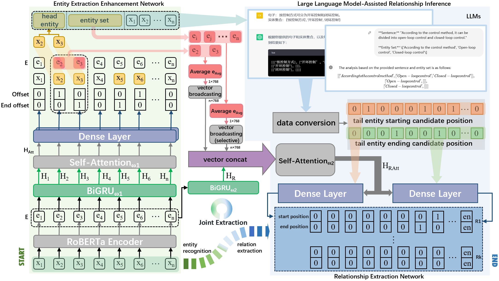

# KGE4s

# Prompt
zero-shot:

Given the following sentence, please identify and extract all head entities and tail entities with relationships in the sentence. The relationships between each pair of entities can be actions, attributes, belongingness, or any other logical connection. Please read and understand the sentence, parse the information, and identify various entities and their attributes.

Please generate the extraction result for the following sentence:
{text}

few-shot：

Given the following sentence, please identify and extract all head entities and tail entities with relationships in the sentence. The relationships between each pair of entities can be actions, attributes, belongingness, or any other logical connection. Please read and understand the sentence, parse the information, and identify various entities and their attributes. The identified head and tail entity pairs can be one or multiple pairs. I will provide you with a learning sample below:

{samples}

Please generate the extraction result for the following sentence according to this instruction. Note that the final result should be given as a list only, without any additional explanation:

{text}
